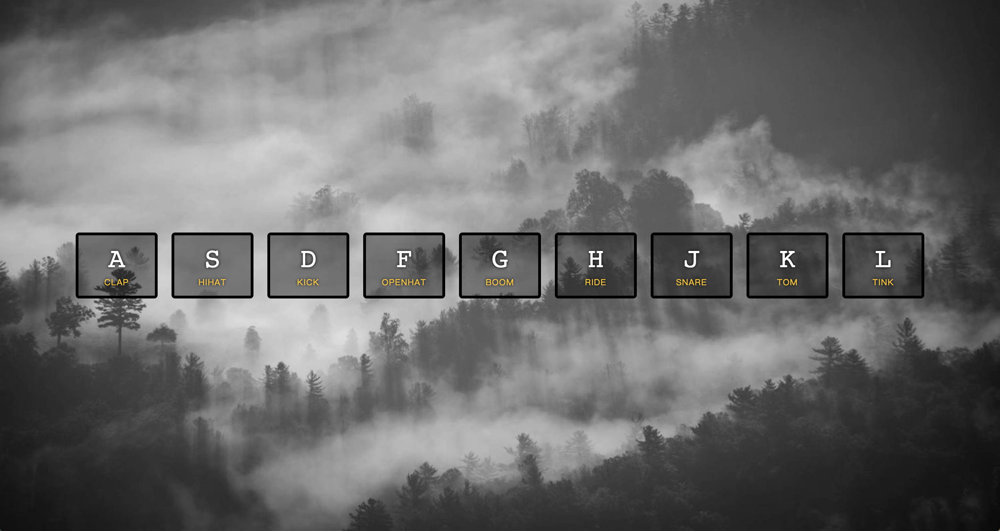

# JS30 day1 - JavaScript Drum Kit
-----

 

#### day1 的功能是透過點擊按鍵發出樂器聲音
#### 這裡要注意的事件有幾項

## 學習重點
-----
1. 找出 keydown 事件給予的 keyCode 的數字
    - 根據 KeyCode 觸發相對應的按鍵發出聲音 
    - 在 html tag 內下 data-key 屬性，並且透過 'audio[data-key="${keycode}"]' 找出對應的按鍵
1. 需要在所有 .key 綁定 transitioned 事件，當事件加入特效後，觸發事件再移除特效
1. 每個音訊的長度都超過3-4秒，為了重複按一個聲音時，可以一直播放，需設定 currentTime = 0; 讓音訊重頭開始
-----

```javascript
<script>
;(function(){
  function removeTransition(e) {
    if(e.propertyName !== "transform") return;
    e.target.classList.remove('playing');
  }
  function keydown(e) {
    let keycode = e.keyCode;
    let audio = document.querySelector(`audio[data-key="${keycode}"]`);
    let key = document.querySelector(`div[data-key="${keycode}"]`);
    if(!audio) return ;
    key.classList.add('playing');
    audio.currnetTime = 0;
    audio.play();
  }
  const all_key = Array.from(document.querySelectorAll('.key'));
  all_key.forEach(el => el.addEventListener('transitionend',removeTransition))
  document.addEventListener('keydown',keydown);
})()
</script>
```