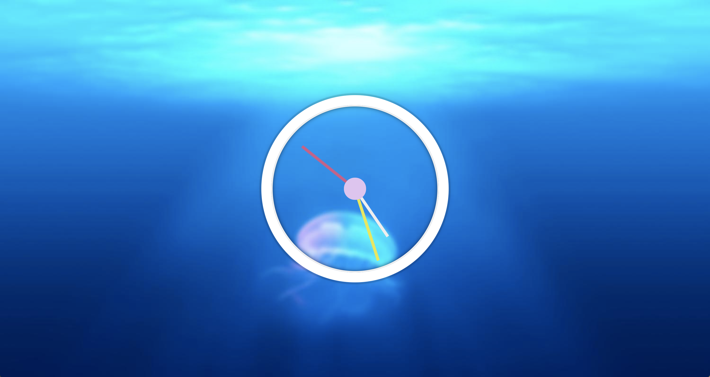

# JS30 day2 - JavaScript and CSS Clock
---

 

#### day2 的功能做出一個時鐘
#### 這裡要注意的事件有幾項

### 前情提要
> 再撰寫功能前有先修改過 HTML 架構及 CSS 
> 改為時、分、秒各為一個 Div 好單獨調整

## 學習重點
-----
1. 先了解如何實體建立一個時間 new Date();
    - 秒：根據一圈 360 度，一分鐘 60 秒，可以了解每秒是 360 / 60s = 6 度 
    - 分：跟秒一樣一小時為 60 分鐘，固每分鐘是 360 / 60min = 6 度
    - 時：一圈 360 共 1-12 小時，每小時為 360 / 12h = 30度
1. 更詳細一點的時間設定
    - 分：除了之前的時間再加上，(現在的秒數 x 一秒的度數 / 一分鐘的秒數)
    - 時：由於整點跟整點之間上面共有 5 個刻度， 因為每個小時是30度，所以要再除以每小時60分鐘， (現在的分鐘 x 每個小時的刻度 / 一小時的分鐘數)
1. 設定區間抓時間有三種方式：setTimeout 、 setInterval 、 window.requestAnimationFrame
    - setTimeout：設定一個時間執行，如果用在時鐘上，設定一秒並重複呼叫函式
    - setInterval: 設定一個執行間距時間，來重複呼叫函式
    - window.requestAnimationFrame: 根據硬體的渲染畫面時間
        - 平均大眾螢幕都是60HZ 渲染時間為1000ms / 60HZ = 16~17ms 最晚在這個時間會渲染一次
        - 高階一點的顯示器都是 120HZ、144HZ 渲染時間為 0.8ms 及 0.6~0.7ms
    - 根據功能來說，如果做滑順的動畫可以使用 requestAnimationFrame 而且不礙於程式方面的 queue
    - 以時鐘來說每秒都是固定 1000ms ，所以使用 setTimeout, setInterval 最方便，若使用 requestAnimationFrame 也可，但效率跟幫助並沒有特別提升｀

-----

```javascript
<script>
  ;(function() {
    const hour_hand = document.querySelector('.hour-hand');
    const min_hand = document.querySelector('.min-hand');
    const sec_hand = document.querySelector('.second-hand');
    function GET_time() {
      const time = new Date();
      const seconds = time.getSeconds();
      const secondsDegree = seconds * 6 ; // 360/60 一圈360度 60秒一分鐘 一秒6度
      sec_hand.style.transform = `rotate(${secondsDegree}deg)`;

      const min = time.getMinutes();
      const minDegree = ((min * 6) + (seconds * 6) / 60);
      min_hand.style.transform = `rotate(${minDegree}deg)`;

      const hour = time.getHours();
      const hourDegree = ((hour * 30) + (min * 30) / 60); // 360 / 12
      hour_hand.style.transform = `rotate(${hourDegree}deg)`;
    }
    GET_time();
    function call_Time() {
      GET_time();
      window.requestAnimationFrame(call_Time)
    }
    window.requestAnimationFrame(call_Time)
  })()
})()
</script>
```