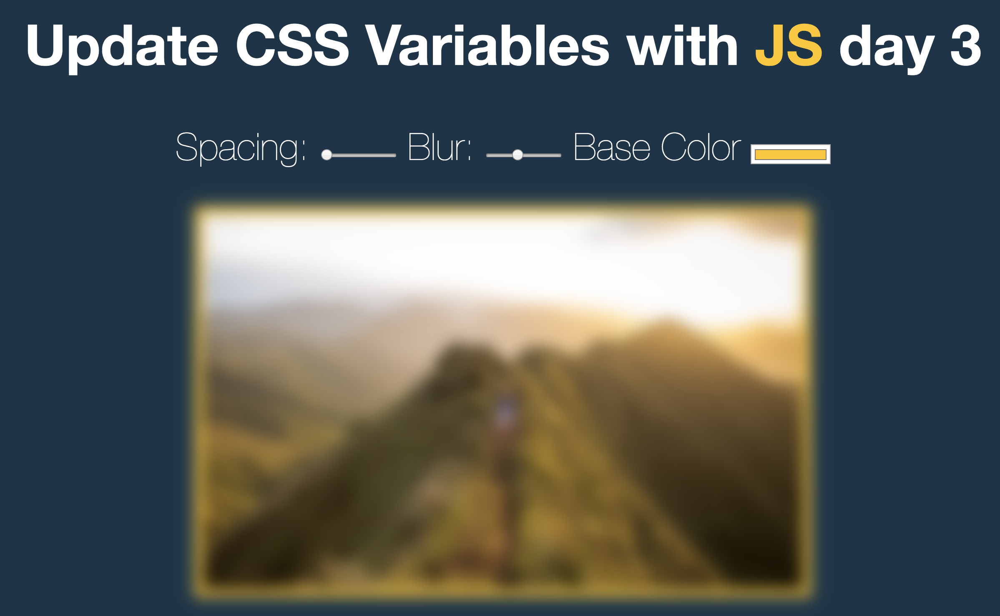

# JS30 day3 - CSS Varibales
---

 

#### day3 的功能可以調整間距、模糊度、背景顏色
#### 這裡要注意的事件有幾項

## 學習重點
-----
1. CSS 中有提供變數可以使用
    - 先在 CSS 中設定變數 :root {
          --variable : xxx
        }
1. 在 HTML input tag 中設定 
    - type 為 range 並設定最小值及最大值
    - 設定 nane 與 CSS變數同名，透過 Js 抓取 name 及 value ,再將 tag 寫入單位屬性
1. 練習中特地做修改，先監聽滑鼠按鍵(mousedown) 的動作去綁定滑鼠移動的事件(mousemove)，當滑鼠放開之後(mouseup)移除移動事件(mousemove)

-----

```javascript
  <script>
    ;(function() {
      const input_arr = document.querySelectorAll('input');
      input_arr.forEach( el => el.addEventListener('change',Change_value));
      input_arr.forEach( el => el.addEventListener('mousedown',Down_mouse));
      input_arr.forEach( el => el.addEventListener('mouseup',up_mouse));
      function Change_value (e) {
        const unit = e.target.dataset.sizing || '';
        document.documentElement.style.setProperty(`--${this.name}`,this.value + unit);
      }
      function Down_mouse (e) {
        this.addEventListener('mousemove',Change_value)
      }
      function up_mouse (e) {
        this.removeEventListener('mousemove',Change_value)
      }
    })()
  </script>
```