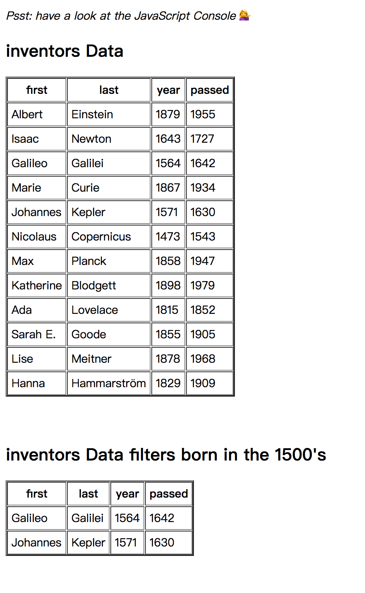
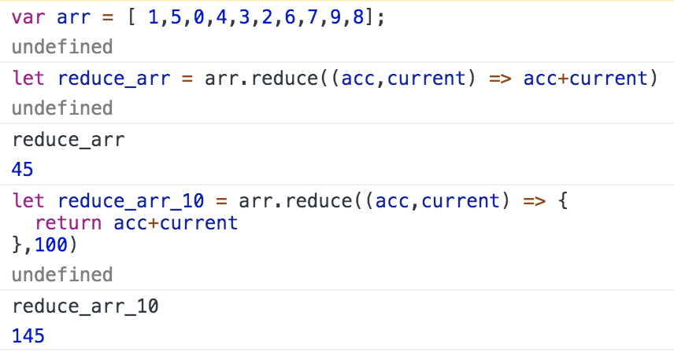

# JS30 day2 - JavaScript and CSS Clock
---

 

#### day4 的項目是處理 Array 

## 各項學習重點
-----
1. 題目一：Filter the list of inventors for those who were born in the 1500's
    - 透過 Filter 過濾出 inventors 出生年在 15世紀的人

1. 題目二：Give us an array of the inventors' first and last names
    - 透過 map 顯示姓和名

1. 題目三：Sort the inventors by birthdate, oldest to youngest
    - 使用 Sort 排列出出生年由老到年輕 
    - Sort 基本解析 
      - Array.prototype.sort() 可透過傳入兩個參數 以 a,b 為參數為例
      - 判斷預設會由 Unicode 碼來做排序
      - 若當 a > b 為 1 則 a 會排在 b 的右邊
      - 反之 a < b 為 -1 則 a 會排在 b 的左邊
      - 排序的方式有很多種，(圖下)為 v8 引擎 sort 的函數
      - 從函數可以看出，當陣列太多會使用 QuickSort ，當數量少時會用 InsertionSort
      - <a href="https://www.youtube.com/watch?v=5nXrEBhBFpU">QuickSort 可參考</a>  <a href="https://www.youtube.com/watch?v=DfloPvgptJA">InsertionSort 可參考</a> 
```javascript 
<script>
function InnerArraySort(array, length, comparefn) {
  // In-place QuickSort algorithm.
  // For short (length <= 22) arrays, insertion sort is used for efficiency.
  if (!IS_CALLABLE(comparefn)) {
    comparefn = function (x, y) {
      if (x === y) return 0;
      if (%_IsSmi(x) && %_IsSmi(y)) {
        return %SmiLexicographicCompare(x, y);
      }
      x = TO_STRING(x);
      y = TO_STRING(y);
      if (x == y) return 0;
      else return x < y ? -1 : 1;
    };
  }
  var InsertionSort = function InsertionSort(a, from, to) {
    // do something
  };

  var GetThirdIndex = function(a, from, to) {
    // do something
  }

  var QuickSort = function QuickSort(a, from, to) {
    // do something
  };
</script>  
```
  1. 題目四：How many years did all the inventors live? 
      - 透過 reduce 加總所有發明者的年齡
      - reduce 基本解析 arr.reduce(function(accumulator(必), currentValue(必), currentIndex(選), array(選)), initialValue(選))
      - 可以傳入五個參數含 initialValue ,  若 initialValue 無設定則默認從 0 開始,也可以設定為 {},[] 等等
       

  1. 題目五：Sort the inventors by years lived? 
      - 透過 Sort 排序發明家的年齡，須先算出年齡，後續解法同第三題

  1. 題目六：create a list of Boulevards in Paris that contain 'de' anywhere in the name
      - 在 https://en.wikipedia.org/wiki/Category:Boulevards_in_Paris 挑出裡面 Ul list 所有含 'de' 的項目
      - 這裡需要先挑出所有 a 連結，但由於挑出來的是類陣列(Array like)，需要用 ES6 Array.from()轉為陣列
      - 轉為陣列後透過 map 先將物件裡面的 textContent 取出文字內容，並透過 filter 將 indexOf('de') >=0 以上的返回
  
  1. 題目七：Sort the people alphabetically by last name
      - 有一組外國人姓名的陣列，題目要我們透過排列只取出名字並且按字母排列
      - 透過 Sort 排序並且先使用 split(',') 切開前後，再取第二組做排序

  1. 題目八：Sum up the instances of each of these
      - 可透過 for loop 或者 reduce 
      - 判斷 item[obj] 是否存在，不存在的話設定 item[obj]=0;
      - 並且將 item[obj]++ 即可去重複及運算數量
-----

```javascript
<script>
    const data = ['car', 'car', 'truck', 'truck', 'bike', 'walk', 'car', 'van', 'bike', 'walk', 'car', 'van', 'car', 'truck' ];
    // for loop
    let data_array = {};
    for(let i=0; i<data.length; i++) {
      let thing = data[i];
      if(!data_array[thing]){
        data_array[thing]=0;
      } 
      data_array[thing]++
    }
</script>
```