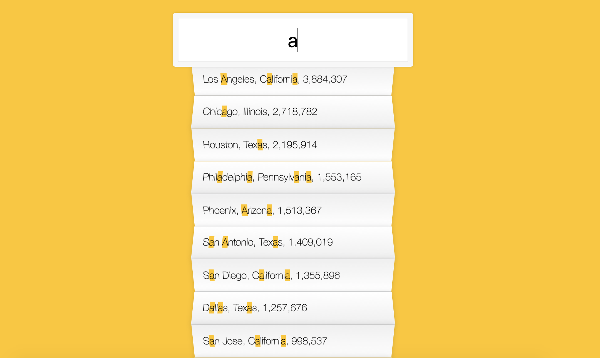

# JS30 day6 - Type Ahead
---

 

#### day6 的項目是處理資料及正規表示法搜尋 

## 學習重點
-----
1. 透過 fetch 將資料用 AJAX 抓下來， 但資料回來需要定義格式，透過 json() 再將資料 return 回來
  -  <a href="https://reurl.cc/vDq6m1">Fetch MDN </a> <a href="https://reurl.cc/9ErR18">卡斯伯 Fetch</a>
1. 輸入再 input 並觸發 keyup 事件，將輸入的英文透過 filter return 不論大小寫符合的字串 new RegExp(val,'gi')，
   再將過濾的資料透過正規表示法把字給 Highlight 起來
```javascript
<script>
const search = document.querySelector('.search');
const suggestions = document.querySelector('.suggestions');
search.addEventListener('keyup',search_endpoint);
function search_endpoint(e) {
  let search = e.target.value;
  let filters_cities = find_match(search)
  const li = filters_cities.map(place => {
    const reg = new RegExp(this.value,'gi');
    const state = place.state.replace(reg,`<span class="hl">${this.value}</span>`);
    const city = place.city.replace(reg,`<span class="hl">${this.value}</span>`);
    const popular = floatnum(place.population);
    return ` 
        <li>
          <span class="name">${city}, ${state}</span>
        </li>`;
  }).join('');
  suggestions.innerHTML= li
}
function floatnum(num) {
   return num.replace(/\B(?=\d{3}+(?!\d))/,',');
}
function find_match(val) {
  return cities.filter(el => {
    const reg = new RegExp(val,'gi');
    return el.state.match(reg) ||  el.city.match(reg)
  });
}
</script>
```
1. 將資料挑選出來後，再將各地區的熱門數量透過正規表示法顯示千分位
  - <a href="https://reurl.cc/b5Xllr">正規表示法入門教學</a>


