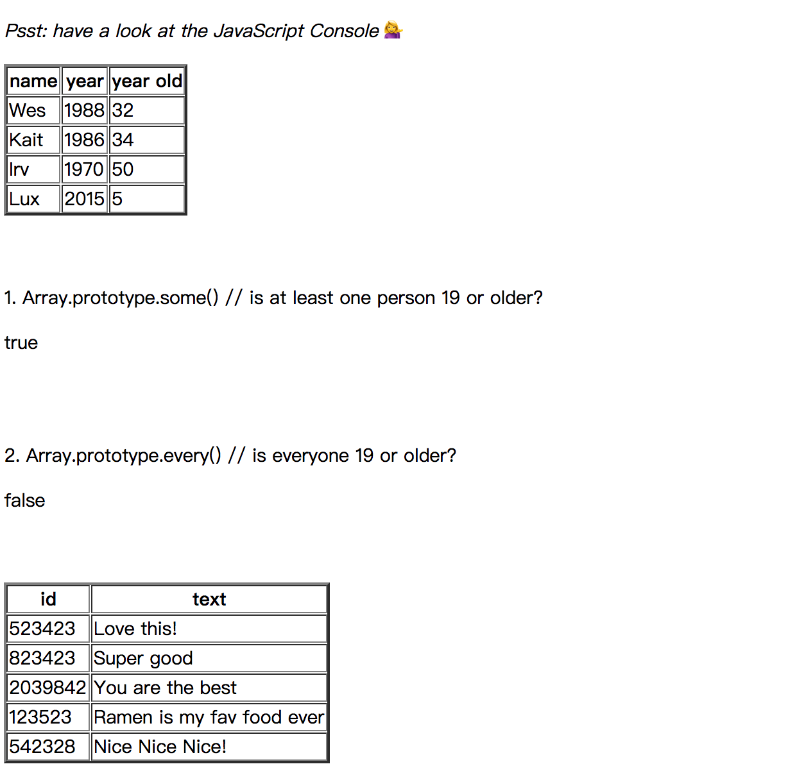

# JS30 day7 - Array Cardio Day 2
---

 

#### day7 的項目是處理 Array 第二系列

## 各項學習重點
-----
1. 題目一：Array.prototype.some() // is at least one person 19 or older?
    - 透過 Some 去遍遞，只要有一人超過 19 歲則回傳 true 反之則 false

1. 題目二：Array.prototype.every() // is everyone 19 or older?
    - 透過 Every 去遍遞，只要所有人超過 19 歲則回傳 true

1. 題目三：Find is like filter, but instead returns just the one you are looking for Find the comment with the ID of 823423
    - 透過 find 找出編號 ID 為 823423

1. 題目四：Find the comment with this ID delete the comment with the ID of 823423
   - 這題題目需要先篩選掉 ID 823423 再顯示其餘的資料
   - Array 有兩個方法可使用 Array.prototype.splice(), Array.prototype.slice() 但是如果使用 splice 則會把原本的陣列破壞
   - Array.prototype.slice() 雖然會產生新的陣列，但是淺拷貝若是修改則一樣會影響到原本物件的資料
   - 陣列是 call by reference，使用同一個記憶體位址
   - <a href="https://blog.techbridge.cc/2018/06/23/javascript-call-by-value-or-reference/">call by value&reference 參考資料</a>
```javascript 
<script>
    const findIndexTable = document.querySelector('#findIndexTable');
    const index = comments.findIndex(el => el.id === 823423);
    // 使用 ES6 解構將 slice() 產生的陣列再插入 findIndexResult
    const findIndexResult =  [...comments.slice(0,index),...comments.slice(index+1)];
    // comment.splice(index,1); // splice 會破壞原先陣列資料
    for(let i = 0;i < findIndexResult.length; i++) {
      let newTr = document.createElement('tr');
          newTr.innerHTML =  `
            <td>${findIndexResult[i].id}</td>
            <td>${findIndexResult[i].text}</td>
          `;
        findIndexTable.append(newTr);
    }
</script>  
```