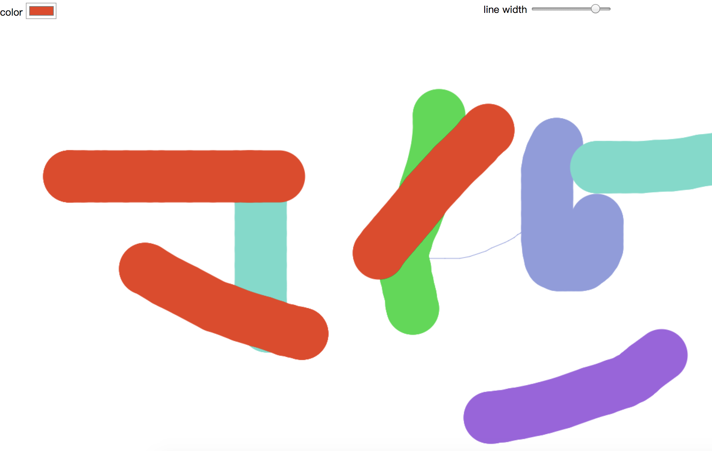

# JS30 day8 - Fun with HTML5 Canvas
---

 

#### day8 的項目是 Canvas 畫布

## 各項學習重點
-----
1.  Canvas 畫布如何實現 <a href="https://developer.mozilla.org/zh-TW/docs/Web/API/Canvas_API/Tutorial">Canvas MDN</a>
    - 如果未給予 Canvas 寬高，預設寬度為 300、高度為 150
    - 在一次開始的時候要先建立畫布及畫布的樣式 '2d'
```javascript 
<script>
const draw = document.querySelector('#draw');
const ctx = draw.getContext('2d');
</script>  
```
1. 最初有幾個地方要先做初始化，'點擊狀況', '滑鼠座標的初始 X 值 ‘, '滑鼠座標的初始 Y 值 ‘, '畫筆樣式'
```javascript 
<script>
 //  畫筆樣式初始化
 ctx.strokeStyle = '#BADA55';
 ctx.lineJoin = 'round';
 ctx.lineCap = 'round';
 //  點擊狀況、初始滑鼠 X Y 值
 let focus = false;
 let lastOffsetX = 0;
 let lastOffsetY = 0;
</script>  
```
1. 透過事件註冊，註冊幾項事件觸發['滑鼠點擊瞬間','滑鼠移動','滑鼠放開']
 - 再使用 ES6 的解構賦值的賦值將資料改變 [a,b] = [c,d] => a = c, b = d 
```javascript 
<script>
 draw.addEventListener('mousedown', mouse_Down);
 function mouse_Down(event) {
    focus = true;
    [lastOffsetX, lastOffsetY] = [event.offsetX, event.offsetY];
 };
</script>  
```
1. 畫布要實現畫圖的方式，要先創建路徑，再選擇初始位子及要畫圖位子並開始畫線，就可以實現小畫家的功能
   - 在使用 Canvas 中，要了解 Canvas 原生的方法
   - 此案例中有額外使用調色盤及調整項目，供別人可更換顏色及畫筆粗細
```javascript 
<script>
 draw.addEventListener('mousedown', mouse_Down);
 function mouse_Move(event) {
    if(!focus) return 
    let currentOffsetX = event.offsetX;
    let currentOffsetY = event.offsetY;
    // 先開始路徑
    ctx.beginPath();
    // 起始路徑
    ctx.moveTo(lastOffsetX, lastOffsetY);
    // 結束路徑
    ctx.lineTo(currentOffsetX, currentOffsetY);
    // 畫線
    ctx.stroke();
    // 將結束路徑設為起始路徑
    [lastOffsetX, lastOffsetY] = [currentOffsetX, currentOffsetY];
 };
</script>  
```