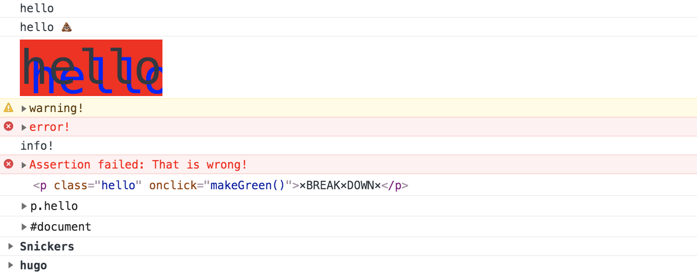

# JS30 day9 - Dev Tools Domination
---

 

#### day9 的項目是 console tool

## 各項學習重點
-----
1. console 工具可多學習，由於此章節較簡單，僅貼上用法
```javascript 
<script>
   console.log('hello');
    // Interpolated
    console.log('hello', '💩');
    // Styled
    console.log('%chello','font-size:50px; background:red; text-shadow: 10px 10px 0 blue');
    // warning!
    console.warn('warning!');
    // Error :|
    console.error('error!');

    // Info
    console.info('info!');
    // Testing
    const p = document.querySelector('p');
    console.assert(p.classList.contains('hello'), 'That is wrong!');
    console.assert(p.classList.contains('world'), 'That is wrong!');
    // clearing
    // console.clear();

    // Viewing DOM Elements
    console.log(p);
    console.dir(p);
    console.dir(document)
    // Grouping together
    dogs.forEach(dog => {
      console.groupCollapsed(`${dog.name}`);
      console.log(`This is ${dog.name}`);
      console.log(`${dog.name} is ${dog.age} years old`);
      console.groupEnd(`${dog.name}`);
    })
    // counting
    console.count('Wes');
    console.count('Wes');
    console.count('Steve');
    console.count('Steve');
    console.count('Wes');
    console.count('Steve');
    console.count('Wes');
    console.count('Steve');
    console.count('Steve');
    console.count('Steve');
    console.count('Steve');
    console.count('Steve');
    //table 
    console.table(dogs);
    // timing
    console.time('loop time')
    for(let i = 0;i<=10000;i++) {
      if(i===10000){
        console.timeEnd('loop time');
      }
    }
    console.time('fetching data');
    fetch('https://api.github.com/users/wesbos')
      .then(data => data.json())
      .then(data => {
        console.timeEnd('fetching data');
        console.log(data);
      });

</script>  
```

