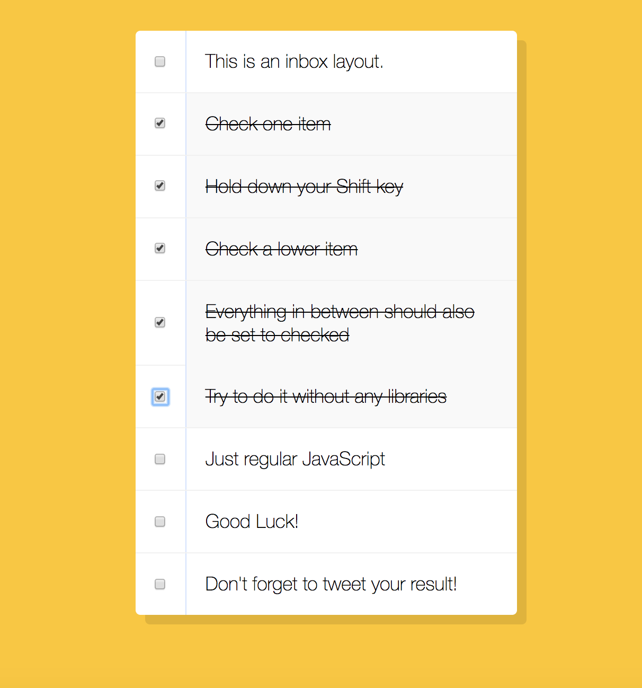
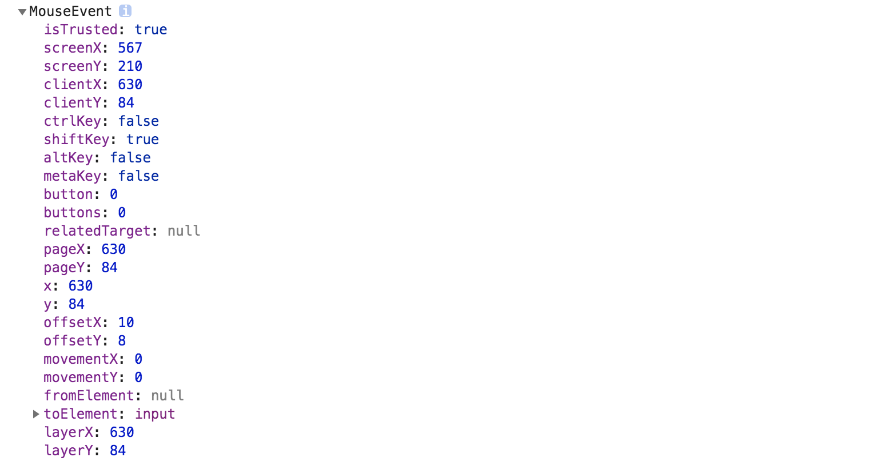

# JS30 day10 - Hold Shift and Check Checkboxes
---

 

#### day10 的項目是按住 shift 並滑鼠點擊 click 事件，藉此勾起區間內的 checkbox

## 各項學習重點
-----
1. 由於原作者的專案一開始使用 shift 點擊後也會將後續的選項勾選，這部分我們修改一下，僅由 shift 點擊的才會區塊選取
2. 我們需要先取得 click 事件觸發的資訊，故所以要將 click event 的資訊傳回給 clickHander
```javascript
<script>
  let checkbox_all = document.querySelectorAll('input[type="checkbox"]'); 
  checkbox_all.forEach((checkbox,idx) => {
    checkbox.addEventListener('click',e => clickHandler(e, idx))
  })
</script>
```
3. 透過 console.log 可以看到事件觸發的資訊，確認是否有按 shiftKey
 

4. 在判斷中須先紀錄前一個有 shift+點擊 checkbox 編號，將編號記錄下來，當第二次用 shift+點擊事件的 checkbox 編號給取出，透過 Math.max & Math.min 找出大小，並且透過 for 迴圈將中間的 checkbox 點擊起來

```javascript
<script>
    let lastbuttonIdx;
    function clickHandler(e,idx) {
      if(e.shiftKey && e.target.checked) {
        let lastbutton = checkbox_all[lastbuttonIdx];
        if(lastbutton && lastbutton.checked === true ){
          let max = Math.max(idx,lastbuttonIdx);
          let min = Math.min(idx,lastbuttonIdx);
          for(let i = min; i < max; i++){
            checkbox_all[i].checked = true
          }
        }
        lastbuttonIdx = idx
      }
    }
</script>
```


