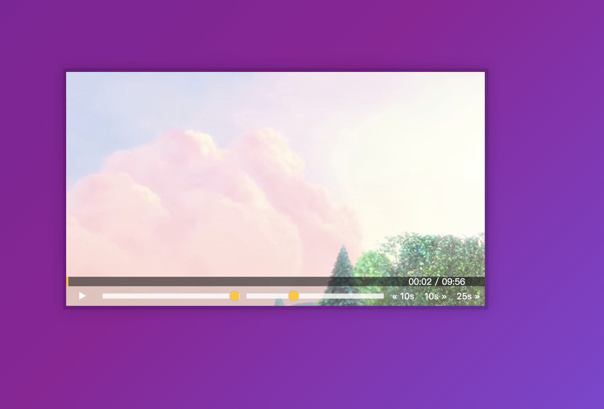

# JS30 day11 - Custom Video Player
---

 

#### day11 的項目是客製化 Video player 播放器

## 各項學習重點
-----
1. Media、Video 元件都是接 HTMLMediaElement 元素，可由下圖來確認．
  - 
2. <a href="https://developer.mozilla.org/en-US/docs/Web/API/HTMLMediaElement">MDN HTMLMediaElement </a>，Video 屬性及原型可以參考 MDN
3. 這邊可以注意幾個較為特別的方法
  - 第一個: 透過 [] 選取key值並使用，從下面範例可以看出，透過判斷的方式決定 video['xx']() 取用的方式
```javascript
<script>
  function toggle_Video() {
  let method = video.paused ? 'play' : 'pause';
  video[method]();
  }
</script>
```
  - 第二個：透過事件觸發時先判斷，減少程式中的判斷邏輯

```javascript
<script>
  let mousedown = false;
  progess.addEventListener('mousemove', (e) => { mousedown && scrub_Video(e) });
</script>
```

4. 此外在練習中加入現在時間及片長時間，由於 currentTime & duration 都是總秒數，並不是實際的時分秒，所以需要轉換影片的長度時間顯示
```javascript
<script>
function progess_videoTime(videoTime) {
  videoTime.forEach(time_arr => {
    let time = time_arr.time;
    let el = time_arr.videoStamp;
    let hr = Math.floor(time / 3600);
    let min = Math.floor((time - (hr * 3600)) / 60);
    let sec = parseInt( time - (hr * 3600) - (min * 60));
    if(min < 10) min = '0' + min;
    if(sec < 10) sec = '0' + sec;
    (hr >=1) ?  hr += ':' : hr = ''
    el.textContent = hr + min + ':' + sec;
  })
}
</script>
```


