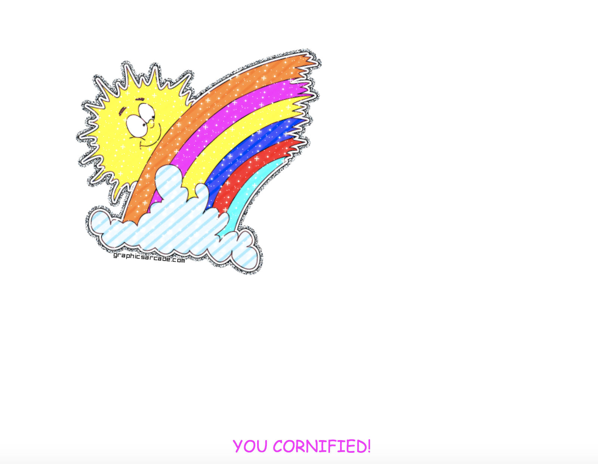

# JS30 day12 - Key Sequence Detection
---

 

#### day12 的項目是猜數字

## 各項學習重點
-----
1. 由於需要紀錄按了哪些按鍵，所以要綁定 keyup 事件觸發
2. 因為要猜中密碼，所以陣列長度也不得超出密碼長度，我的方法是當長度超出密碼時，將第一個陣列位子去掉
```javascript
<script>
  window.addEventListener('keyup', e => {
    inputCode.push(e.keyCode);
    if(inputCode.length > secretCode.length) {
      inputCode.shift()
    }
    if(inputCode.join('') == secretCode.join('')) {
      console.log('DING DING!');
      cornify_add();
    }
  })
</script>
```
3. wesbos 作者的方式是使用 <a href="https://developer.mozilla.org/zh-TW/docs/Web/JavaScript/Reference/Global_Objects/Array/splice">splice</a> 來去掉第一個位子，減少 if 判斷式的方法
 - splice(x,y) x 為負數時則從後面開始算，當 x 負數總長大於陣列長度時為 0 ，所以做作者使用 -inputCode 長度 -1 ，必定為 0 ，預設 inputCode 長度 - sercretCode 為負 or 0，不會刪除陣列數字，當 y > 0 之後則會刪除
```javascript
<script>
 window.addEventListener('keyup', e => {
    inputCode.push(e.keyCode);
    inputCode.splice(-inputCode.length -1, inputCode.length - secretCode.length);
    if(inputCode.join('') == secretCode.join('')) {
      console.log('DING DING!');
      cornify_add();
    }
  })
</script>
```


