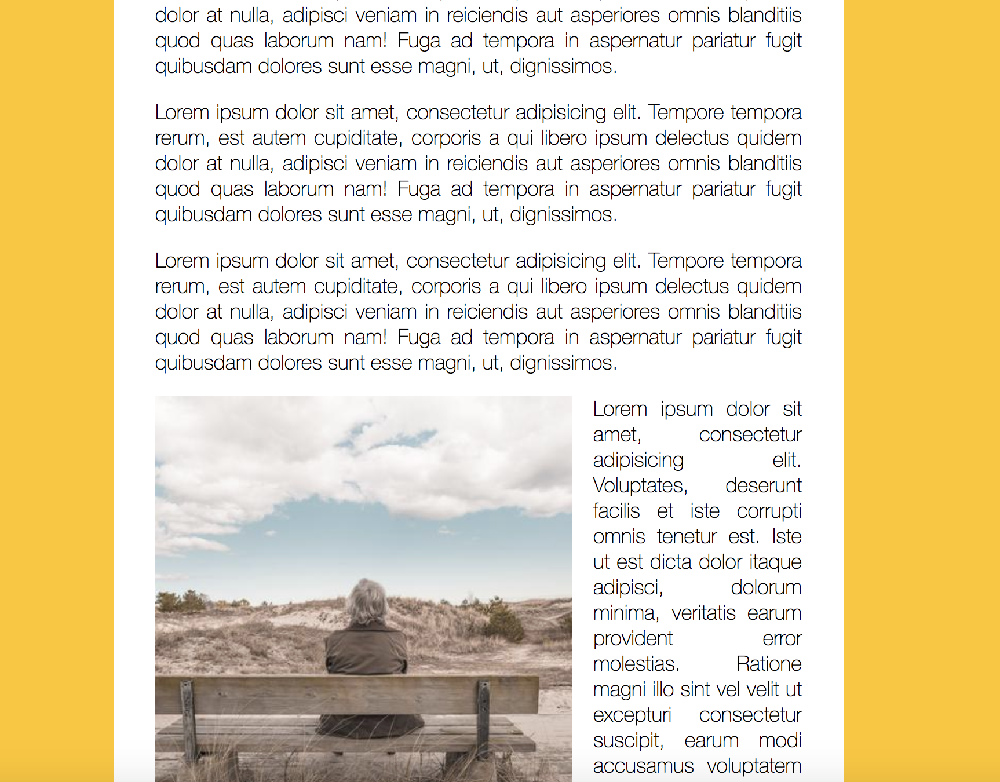
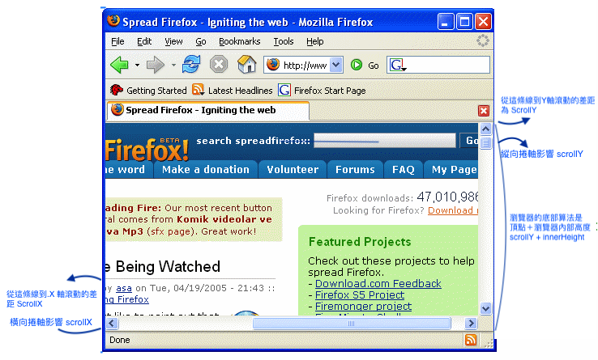

# JS30 day13 - Slide in on Scroll
---

 

#### day13 的項目是滾動捲軸，捲軸高度大於圖片時，圖片則顯示，當高度完全超過圖片，圖片則消失

## 各項學習重點
-----
1. 在開始之前，我們要先搞懂 document 及物件的高度怎麼算，頂點、中間及底部。
  - 瀏覽器的高度分為 window.innerHeight 以及 window.outerHeight
   
  - <a href="https://developer.mozilla.org/zh-CN/docs/Web/API/Window/outerHeight">Window.outerHeight</a> 
  - 知道了瀏覽器內部的高度怎麼統計之後，來看看捲軸的高度怎麼算
  - 
  - 瀏覽器的底部為 scrollY + innerHeight (瀏覽器高度)
  - 物件的底部為 el.offsetTop (物件頂點的位置) + el.Height (物件總高度) 
2. 由上述知道了怎麼計算瀏覽器的高度及物件的高度，那麼為了 UX 可讓使用者有較好的體驗，
  - 在瀏覽器底部超過物件的中間點時將圖片渲染出現
  - 在瀏覽器高度超過圖片底部時，將圖片消失
```javascript
<script>
    let imgAll = document.querySelectorAll('img');
    function scrollHandler(e) {
      imgAll.forEach(img => {
        let windowTop = window.scrollY;
        let windowBottom = window.scrollY + window.innerHeight; 
        let imgTop = img.offsetTop;
        let imgBottom = img.offsetTop + img.height;
        let imgMiddle = img.offsetTop + (img.height / 2);
        if(windowBottom > imgMiddle && windowTop < imgBottom) {
          img.classList.add('active');
        } else {
          img.classList.remove('active');
        }
      })
    }
</script>
```
3. wesbos作者在這個案例中加入了優化的功能 debounce
  - 解析 debounce 流程，如何優化事件觸發
  - 由於 scroll 事件響應是當滾動捲軸時則觸發一次，為了降低觸發事件執行的次數，則用節流閥 (dedounce, throttle) 來限制事件觸發的數量。
  - 作者版 
  Step1: 觸發第一次 debounce 時，初始 timeout 為 null 會先用 clearTimeout 清空 setTimeout，到了 callNow 時 immediate為 true 則 !timeout 也是 true ，第一次 callNow則為 true 會觸發 func.apply 並立即執行一次
  Step2: 第二次觸發後，由於閉包 (clourse) 的關係，第二次則會有數字 (計時器的ID)，再透過 setTimeout 執行。
  缺點：當滑鼠一直滾動而永不停時，第一次會觸發 func，第二次 timeout 會一直被清除又重相賦予值
 </br>
 - 作者的 debounce 比較適用在 mousemove 須停下才觸發等等之類的事件，我們更改為至少需要重複觸發一次(每100ms)觸發一次
 - 修改版本:
  Step1: 初始 timeout 為 null ，但加入判斷 timeout 是否有值，初始沒值會往下執行，會先賦予 timeout 值再執行第一次 func
  Step2: 當重複執行時，由於 timeout 在閉包中還是有值 (setTimeout的ID)，則會被return，直到 100ms 執行 setTimeout 的 func，再重複第一階段的步驟
PS 補充：<a href="https://developer.mozilla.org/zh-CN/docs/Web/API/Window/setTimeout"> setTimeout(ID如何產生)</a>
```javascript
<script>
    window.addEventListener('scroll', debounce(scrollHandler))
    // 作者的 debounce 
    function debounce(func, wait = 100, immediate = true) {
      var timeout;
      return function() {
        var context = this, args = arguments;
        var later = function() {
          timeout = null;
          if (immediate) {
            func.apply(context, args);
            }
        };
        var callNow = immediate && !timeout;
        clearTimeout(timeout);
        timeout = setTimeout(later, wait);
        if (callNow) {
          func.apply(context, args);
          }
      };
    };

    // 修改後的
    function debounce(func, wait = 100, immediate = true) {
      var timeout;
      return function() {
        var context = this, args = arguments;
        var later = function() {
          timeout = null;
          func.apply(context, args);
        };
        if(timeout) return 
        var callNow = immediate && !timeout;
        clearTimeout(timeout);
        timeout = setTimeout(later, wait);
        if (callNow) func.apply(context, args);
      };
    };
</script>
```
- 有類似於 debounce 的功能，throttle (節流閥)，這也較適合時間內至少會觸發一次。
- 這邊會記錄兩個變數 last、timer
Step1: 一開始 last 和 timer 都是 null， now 會等於 (new Date()).getTime() 時間戳，到了判斷式時，由於 last 為 null 則會進入到 else { last = now } 並執行一次func
</br>
Step2: 第二次快速執行的時候，會再產生新的時間戳，由於 last 因為閉包的關係會儲存上次時間戳的時間 last 為 true ; now 也為 true 但如果快速執行的時間如果小於 last + 250 ms 的話，則會賦予 timer 新的 setTimeout 時間，直到觸發為止。
但如果一直快速觸發，當新得時間戳大於 last + 250 ms 的時間戳，則會重新賦予 last 並在執行一次程式
結論：每當時間在 250ms 內重複觸發得不重複執行，則由 setTimeout觸發，當程式重複執行時，至少每250 ms 會執行一次程式
PS 補充：<a href="https://developer.mozilla.org/en-US/docs/Web/JavaScript/Reference/Global_Objects/Object/valueOf"> +new Date()用法來源</a>
```javascript
  window.addEventListener('scroll', throttle(scrollHandler))
  function throttle(func, threshhold = 250) {
    let last, timer;
    return function () {
      var context = this
      var args = arguments
      var now = +new Date()
      if (last && now < last + threshhold) {
        clearTimeout(timer)
        timer = setTimeout( () => {
          last = now
          func.apply(context, args)
        }, threshhold)
      } else {
        last = now
        func.apply(context, args)
      }
    }
  }
</script>
```

### 課後補充
如果圖片要做成 lazyload 的時候，也可以透過捲軸的 scrollY 來完成，當捲軸底部高於圖片高度時載入圖片
<a href="./index-lazyload.html"> Lazyload DEMO </a>
- 作法則是，先建立一個 div 並且判斷 div 的位子，當捲軸高度超過 div 頂端時載入 img 元件並載入圖片
- 唯一一點要探討的是，在判斷的時候要加入 !img.children.length 如果不判斷裡面子元素是否加入的話，則會一直無限加入 img 元件進去
```javascript
<script>
    let imgAll = document.querySelectorAll('.img');
    function scrollHandler(e) {
      imgAll.forEach(img => {
        let windowTop = window.scrollY;
        let windowBottom = window.scrollY + window.innerHeight; 
        let imgTop = img.offsetTop;
        let imgBottom = img.offsetTop + img.height;
        let imgMiddle = img.offsetTop + (img.height / 2);
        if(windowBottom > imgTop && !img.children.length)  {
          let lazyload = document.createElement('img')
          lazyload.setAttribute('src','http://unsplash.it/400/400');
          img.append(lazyload);
        } 
      })
    }
</script>
```

#### 參考來源
- <a href="https://www.youtube.com/watch?v=PRRZlAVvJ7A&list=PLEfh-m_KG4dYbxVoYDyT_fmXZHnuKg2Fq&index=14&t=0s">alex 宅知道 JS30days</a>
- 