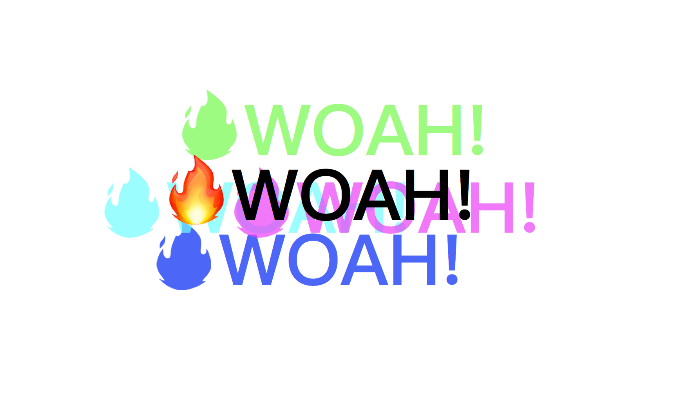

# JS30 day14 - JavaScript References VS Copying
---

 

#### day16 的項目是滑鼠移動後的文字影子

## 各項學習重點
-----
1. 這章節講的是如何使用滑鼠移動事件以及了解offsetWeight, offsetHeight, clientWidth, scrollWidth 差異
 - offsetWidth/offsetHeight 是「元素本身」的寬度/高度，並完整了包含了邊界、捲軸及padding。

 - clientWidth/clientHeight 則是元素所包含的「子元素」的寬度/高度，其中包含了padding，但不包含邊界及捲軸。

 - scrollWidth/scrollHeight 也是元素所包含的「子元素」的「完整」寬度和高度，其中包含了超出捲軸之外的部分的寬度與高度。在沒有捲軸的情況下，這個值就等於 clientWidth/clientHeight。

2. 相對位置 - 關於元素的相對位置，同樣也有三組屬性可以使用，

  - offsetLeft/offsetTop 是元素本身相對於母元素的水平/垂直距離。

  - clientLeft/clientTop 是元素本身內外的水平/垂直距離，也就是左邊/上面的邊界寬度。（但要注意文字右到左時，左邊有捲軸的情況下，也會包含捲軸寬度）

  - scrollLeft/scrollTop 是「內容」被捲動的距離，也就是內容頂端和捲軸頂端的相對距離。這個屬性很常用到，一定要跟他很熟！

3. clientX,offsetX 差異

  -  event.offsetX、event.offsetY ，滑鼠相對於事件源元素（srcElement）的X,Y坐標，只有IE事件有這2個屬性，標準事件沒有對應的屬性。

  - event.clientX、event.clientY，滑鼠相對於瀏覽器窗口可視區域的X，Y坐標（窗口坐標），可視區域不包括工具欄和滾動條。IE事件和標準事件都定義了這2個屬性

5. ES6 - 解構賦值
```javascript
<script>
Case1:
  let [a, b] = [10,20];
  console.log(a,b);  // 10, 20

Case2:
  let object = {
    width: 100,
    height: 200
  };
  let {width, height} = object;
  console.log(width, height); // 100, 200

  let {width:W, height:H} = object;
  console.log(W,H); //100, 200
</script>
```

4. 注意事項, e.offsetX, e.offsetY 取決於指向的元件與滑鼠間的距離，如果 e.target 不等於 this (event事件綁在外層)，需要先將外層元件的位子取出  e.target.offsetLeft, e.target.offsetTop 再加上元件與滑鼠的距離
5. 可以再offsetX ,offsetY 計算後增加 -50 之類的固定數值，來增加移動量，並且在x=0 , y=0時不位移的情況做處理